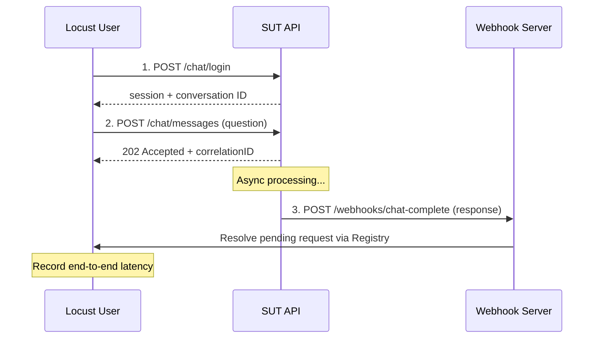

# locust-async-chat

A **Locust-based load testing framework** for asynchronous conversational AI agents. locust-async-chat sends chat messages to a System Under Test (SUT), then measures true end-to-end latency by waiting for webhook callbacks rather than immediate HTTP responses.

## Why locust-async-chat?

Most load testing tools measure HTTP round-trip time. But conversational AI systems are often **asynchronous** -- you POST a message, receive a `202 Accepted` immediately, and the actual response arrives later via webhook. locust-async-chat bridges this gap:

- Sends messages to your chat API and **waits for the real response** via webhook callback
- Measures **end-to-end latency** (message sent -> response received), not just HTTP latency
- Simulates realistic **multi-turn conversations** with LLM-generated follow-up messages
- Runs on [Locust](https://locust.io/) with full web UI for real-time metrics

For a deeper dive into the design decisions, architecture, and extensibility of this project, see the [Technical Report](tech-report.md).

## Architecture

```
    +-------------------+       +------------------+
    |  LangSmith        |       |  AI Provider     |
    |  Dataset          |       |  (LLM-generated) |
    +---------+---------+       +---------+--------+
              | questions                 | questions
              +------------+--------------+
                           v
+----------+    login   +--------------+    message    +---------+
|  User    |----------->|   Locust     |-------------->|   SUT   |
|  Pool    |  user info |   User       |   + question  |         |
+----------+            +--------------+               +----+----+
   Doe1, Doe2...               ^                            |
                               | callback                   v
                         +-----+------+            +------------+
                         |  Webhook   |<-----------|  SUT Bot   |
                         |  Server    |  response  |            |
                         +------------+            +------------+
```

**The key insight:** Locust users don't just fire-and-forget HTTP requests. Each user POSTs a message, then blocks on a `gevent.AsyncResult` until the webhook server receives the SUT's callback and resolves the pending request. This gives you accurate end-to-end latency under realistic concurrency.

## Quick Start

### Prerequisites

- Python >= 3.14
- [uv](https://docs.astral.sh/uv/) (recommended) or pip

### Install

```bash
git clone https://github.com/your-org/conversational-assistants-simulator.git
cd conversational-assistants-simulator
uv sync
```

### Configure

```bash
cp .env.example .env
# Edit .env with your SUT URLs and credentials
```

Required environment variables:

| Variable | Description |
|----------|-------------|
| `LOADTEST_SUT_LOGIN_URL` | URL where your SUT accepts login/session requests |
| `LOADTEST_SUT_SUBMIT_URL` | URL where your SUT accepts chat messages |
| `LOADTEST_SUT_AUTH_HEADER` | Authorization header value (e.g. `Bearer xxx`) |

### Run

```bash
# Start Locust with web UI at http://localhost:8089
uv run locust -f src/locust_async_chat/locustfile.py
```

Open http://localhost:8089, set the number of users and spawn rate, and start the test.

### Docker

```bash
docker build -t locust-async-chat .
docker run --rm --env-file .env -p 8089:8089 -p 44379:44379 locust-async-chat
```

## How It Works



1. **Login** -- Each simulated user authenticates and gets a conversation ID
2. **Submit** -- User sends a question; SUT returns a correlation ID immediately
3. **Wait** -- User blocks (via `gevent.AsyncResult`) until the webhook server receives the SUT's callback
4. **Measure** -- End-to-end latency is recorded as a custom Locust metric

## Message Providers

locust-async-chat supports two ways to generate test messages:

### LangSmith Dataset (`--message-provider langsmith`)
Load questions from a [LangSmith](https://smith.langchain.com/) dataset. Good for repeatable benchmarks with curated questions.

```bash
uv run locust -f src/locust_async_chat/locustfile.py --message-provider langsmith --langsmith-dataset "My Dataset"
```

### AI Provider (`--message-provider ai`)
Generate dynamic, multi-turn conversations using an LLM. Each simulated user gets a topic (e.g. "appointment booking") and the LLM generates contextually appropriate messages based on the SUT's responses.

```bash
uv run locust -f src/locust_async_chat/locustfile.py --message-provider ai --llm-deployment gpt-4o-mini
```

See [AI Provider docs](src/locust_async_chat/providers/ai/README.md) for details on topics, conversation flow, and LangSmith sync.

## Configuration

All settings can be configured via environment variables, CLI arguments, or the Locust web UI.

<details>
<summary>Full configuration reference</summary>

| CLI argument | Environment variable | Description | Default |
|--------------|----------------------|-------------|---------|
| *(env only)* | `LOADTEST_SUT_LOGIN_URL` | URL for login requests | *(required if login enabled)* |
| *(env only)* | `LOADTEST_SUT_SUBMIT_URL` | URL for message submission | *(required)* |
| *(env only)* | `LOADTEST_SUT_AUTH_HEADER` | Authorization header | *(required)* |
| *(env only)* | `LOADTEST_LOGIN_ENABLED` | Enable/disable login step | `true` |
| *(env only)* | `LOADTEST_CALLBACK_BIND_PORT` | Webhook server port | `44379` |
| `--sut-switchboard-name` | `LOADTEST_SUT_SWITCHBOARD_NAME` | Filter callbacks by switchboard name | *(empty = accept all)* |
| `--callback-timeout` | `LOADTEST_CALLBACK_TIMEOUT_S` | Webhook callback timeout (seconds) | `90` |
| `--wait-time-min` | `LOADTEST_WAIT_TIME_MIN_S` | Min seconds between tasks per user | `5` |
| `--wait-time-max` | `LOADTEST_WAIT_TIME_MAX_S` | Max seconds between tasks per user | `10` |
| `--message-provider` | `LOADTEST_MESSAGE_PROVIDER` | `langsmith` or `ai` | `langsmith` |
| `--langsmith-dataset` | `LOADTEST_LANGSMITH_DATASET` | LangSmith dataset name | `Benchmark` |
| `--llm-deployment` | `LLM_DEPLOYMENT` | LLM deployment for AI provider | *(from env)* |
| `--llm-temperature` | `LLM_TEMPERATURE` | LLM temperature (0.0-2.0) | `0.7` |
| `--topic-selection-strategy` | `LOADTEST_TOPIC_SELECTION_STRATEGY` | `random` or `round_robin` | `random` |
| `--user-given-name` | `LOADTEST_USER_GIVEN_NAME` | Base given name for test users | `John` |
| `--user-surname-prefix` | `LOADTEST_USER_SURNAME_PREFIX` | Surname prefix (suffixed with number) | `Doe` |
| `--user-email-domain` | `LOADTEST_USER_EMAIL_DOMAIN` | Email domain for test users | `locust.com` |

</details>

## Project Structure

```
src/locust_async_chat/
├── locustfile.py              # Entry point, lifecycle hooks
├── config/
│   └── config.py              # LoadTestConfig, CLI args, env vars
├── users/
│   ├── user_pool.py           # Thread-safe test user generation
│   └── user.py                # SutAsyncUser (Locust HttpUser subclass)
├── models/
│   ├── callback.py            # Webhook callback payloads
│   ├── login.py               # Login request/response models
│   ├── message.py             # Message payload builder
│   └── parsers.py             # Response ID extraction
├── infrastructure/
│   ├── registry.py            # Callback correlation (gevent AsyncResult)
│   └── webhook_server.py      # Flask webhook receiver
├── providers/
│   ├── base.py                # MessageProvider protocol
│   ├── langsmith/             # LangSmith dataset provider + writer
│   └── ai/                    # LLM-powered message generation
└── llm/
    ├── config.py              # Multi-resource LLM configuration
    └── client.py              # Unified LLM client (OpenAI/Anthropic)
```

## Development

```bash
# Install with dev dependencies
uv sync

# Run all checks
bash scripts/check.sh

# Or individually:
uv run ruff check src/         # Lint
uv run black --check src/      # Format check
uv run mypy src/               # Type check
uv run pytest                  # Tests (133 tests)
```

## CI

GitHub Actions runs on every push and PR:
- **lint-check** -- ruff, black, deptry, mypy, pytest
- **docker-build-test** -- builds the Docker image and verifies the container starts

## Contributing

Contributions are welcome. Please ensure all checks pass before submitting a PR:

```bash
bash scripts/check.sh
```

## License

MIT
